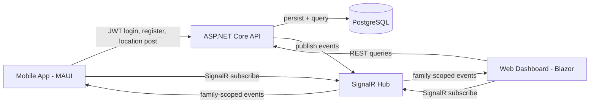

# FamBeacon Implementation Plan

This document defines a practical, engineering-first implementation plan for FamBeacon: a privacy-first, self-hosted family location tracking system.

## 1. High-Level Architecture

### Components
1. Mobile App (.NET MAUI)
   - Captures location, battery level, and basic device state.
   - Authenticates user and device.
   - Sends location updates via REST API.
   - Receives real-time family updates via SignalR.
2. API Backend (ASP.NET Core)
   - Exposes REST endpoints for auth, devices, families, locations, geofences, and history.
   - Enforces authorization and family-scoped data access.
   - Publishes domain events to SignalR.
3. Real-Time Layer (SignalR)
   - Broadcasts family-scoped live updates to connected web/mobile clients.
4. Database (PostgreSQL)
   - Stores users, families, devices, locations, geofences, refresh tokens, and event records.
5. Web Dashboard (Blazor Server recommended for MVP)
   - Displays live map and status.
   - Manages families, devices, geofences, and history.
6. Deployment (Docker Compose)
   - Runs API, web, PostgreSQL, and optional reverse proxy.

### Interaction Model
- REST handles state-changing requests and historical queries.
- SignalR handles low-latency live updates.
- All data access is authorized by family membership.
- Mobile uses offline queue + retry for local-first behavior.

### Clean Architecture Boundaries
- Domain: entities, value objects, business rules.
- Application: use cases, validation orchestration, policies.
- Infrastructure: EF Core, auth/token persistence, SignalR adapters.
- Presentation: controllers, hub, web/mobile UI.

## 2. System Design Diagram (Text-Based)

Data flow sequence:
1. Mobile app authenticates and obtains access + refresh token.
2. Mobile app registers device through provisioning flow.
3. Mobile app posts location data.
4. API stores location, updates device status, evaluates geofence transitions.
5. API emits SignalR events to family group.
6. Web dashboard and subscribed clients render updates.

## 3. Database Design

### Main Entities
1. Users
   - id (uuid, pk), email (unique), password_hash, display_name, is_active, created_at, updated_at.
2. Families
   - id (uuid, pk), name, created_by_user_id (fk Users), created_at.
3. FamilyMembers
   - id (uuid, pk), family_id (fk Families), user_id (fk Users), role (Owner/Admin/Member), joined_at.
   - Unique: (family_id, user_id).
4. Devices
   - id (uuid, pk), family_id (fk Families), user_id (fk Users), name, platform, app_version, status, battery_level, last_seen_at, created_at.
5. Locations
   - id (bigserial, pk), device_id (fk Devices), family_id (fk Families), user_id (fk Users), latitude, longitude, accuracy_m, speed_mps, heading_deg, altitude_m, battery_level, captured_at_utc, received_at_utc, source.
   - Indexes: (family_id, captured_at_utc desc), (device_id, captured_at_utc desc).
6. Geofences
   - id (uuid, pk), family_id (fk Families), name, center_lat, center_lng, radius_m, is_active, created_at.
7. GeofenceStates
   - id (bigserial, pk), geofence_id, device_id, is_inside, last_transition_at.
8. GeofenceEvents
   - id (bigserial, pk), geofence_id, device_id, family_id, event_type (Entered/Exited), occurred_at_utc.
9. RefreshTokens
   - id (uuid, pk), user_id (fk Users), device_id (nullable fk Devices), token_hash, expires_at, revoked_at, replaced_by_token_id, created_at, ip, user_agent.
10. DeviceProvisioningTokens
   - id (uuid, pk), family_id, created_by_user_id, token_hash, expires_at, consumed_at, one_time_use.

### Relationship Summary
- User <-> Family is many-to-many through FamilyMembers.
- User has many Devices.
- Device has many Locations.
- Family has many Devices, Locations, Geofences.
- Geofence has many GeofenceEvents and per-device GeofenceStates.
- User has many RefreshTokens.

## 4. Backend Module Breakdown

1. Auth Service
   - Registration/login/logout/refresh.
   - JWT issuance + refresh token rotation/revocation.
   - Password hashing and claim generation.
2. Device Service
   - Provisioning token generation/validation.
   - Device registration/update/revoke.
   - Online/offline + battery state bookkeeping.
3. Location Service
   - Ingest single/batch locations.
   - Validate/normalize/deduplicate samples.
   - Persist + emit location/state events.
4. Family Service
   - Family creation and membership management.
   - Role updates and access checks.
5. Geofence Service
   - Geofence CRUD.
   - Arrival/departure detection (radius-based for MVP).
6. Notification Service
   - Internal event dispatch to SignalR.
   - Notification/event history persistence.

## 5. API Design

### Authentication
- POST /api/v1/auth/register
- POST /api/v1/auth/login
- POST /api/v1/auth/refresh
- POST /api/v1/auth/logout
- GET /api/v1/auth/me

### Device Registration
- POST /api/v1/devices/provisioning-tokens
- POST /api/v1/devices/register
- GET /api/v1/devices
- PATCH /api/v1/devices/{deviceId}
- DELETE /api/v1/devices/{deviceId}

### Location Submission
- POST /api/v1/locations
- POST /api/v1/locations/batch
- GET /api/v1/locations/latest?familyId={id}

### Family Management
- POST /api/v1/families
- GET /api/v1/families/{familyId}
- POST /api/v1/families/{familyId}/members
- PATCH /api/v1/families/{familyId}/members/{userId}
- DELETE /api/v1/families/{familyId}/members/{userId}

### Geofence CRUD
- POST /api/v1/families/{familyId}/geofences
- GET /api/v1/families/{familyId}/geofences
- PATCH /api/v1/families/{familyId}/geofences/{geofenceId}
- DELETE /api/v1/families/{familyId}/geofences/{geofenceId}

### History Retrieval
- GET /api/v1/history/locations?familyId={id}&deviceId={id?}&from={utc}&to={utc}&page={n}&size={n}
- GET /api/v1/history/geofence-events?familyId={id}&from={utc}&to={utc}

### API Standards
- Versioned routes (/api/v1).
- RFC 7807 ProblemDetails for errors.
- Idempotency-Key support on batch location ingestion.

## 6. Real-Time Design (SignalR)

### Hub Topology
- Single hub for MVP: FamBeaconHub.
- Group naming: family:{familyId}.

### Events Published
- location.updated
- device.status.changed
- device.battery.updated
- geofence.entered
- geofence.exited

### Event Consumers
- Authenticated family members only.

### Event Envelope
- eventId
- eventType
- familyId
- occurredAtUtc
- sourceDeviceId
- schemaVersion
- payload

### Connection Flow
1. Client connects with JWT.
2. Server validates claims and family membership.
3. Client joins all authorized family groups.
4. Disconnect cleans transient presence state.

## 7. Mobile App Responsibilities

### Tracking Strategy (Battery Optimized)
1. Adaptive sampling profile:
   - Fast movement: 10-20s interval.
   - Normal movement: 30-60s.
   - Stationary or low battery: 2-5 min.
2. Minimum displacement threshold before sending.
3. Batch send when reconnecting from offline state.

### Background Behavior
- Android: foreground service + persistent notification.
- iOS: background location mode + significant-change fallback.
- Local queue using SQLite with retry/backoff.

### QR Onboarding Flow
1. User receives one-time provisioning token.
2. App scans QR containing server URL + token + expiry.
3. App exchanges token for device registration.
4. Token is consumed immediately and cannot be reused.

### API Communication
- REST for auth, device registration, location upload, history.
- SignalR for live family updates.
- Refresh token stored in secure platform storage.

## 8. Web Dashboard Features

1. Map View
   - OpenStreetMap tiles (Leaflet or MapLibre).
   - Live markers with heading/accuracy/stale indicators.
2. Family/Device Management
   - Member roles, registered devices, status metadata.
3. Live Tracking UI
   - SignalR-driven updates and reconnect behavior.
4. History View
   - Time-range filtering, path plotting, geofence event timeline.
5. Operations
   - Provisioning QR generation and token lifecycle visibility.

## 9. Security Model

### JWT and Refresh Flow
- Access token: short-lived (10-20 min).
- Refresh token: longer-lived, rotated on refresh.
- Refresh token stored hashed in database.

### Device Authentication
- Device identity bound to user + family.
- Device credentials revocable independently.

### QR Provisioning Security
- One-time short-lived token (5-15 min).
- No long-lived secret in QR payload.
- Replay resistance through one-time token consumption.

### Data Protection
- TLS required in production.
- Secrets via environment variables/docker secrets.
- Family-scoped authorization checks in all modules.
- Audit logs for login/refresh/registration/role changes.
- Configurable retention for location history.

## 10. MVP Definition

### Must-Have Features
1. User auth with JWT + refresh tokens.
2. Family creation + membership roles.
3. Device registration via secure provisioning token (QR transport).
4. Mobile location ingestion.
5. Real-time updates via SignalR.
6. Location history retrieval.
7. Circular geofences with enter/exit detection.
8. Battery and online/offline status.
9. Docker Compose self-host deployment.

### Explicitly Excluded from MVP
1. APNs/FCM push notifications.
2. Polygon/route geofences.
3. Multi-node SignalR backplane scaling.
4. Federation and Home Assistant integration.
5. Wearables and advanced SOS workflows.

## 11. Milestone Plan (Phases)

### Phase 1: Backend Foundation
1. Create solution structure and project boundaries.
2. Add EF Core + Npgsql and first migrations.
3. Add health checks, structured logging, OpenAPI.
4. Deliverable: API + PostgreSQL running via Docker Compose.

### Phase 2: Auth + Devices
1. Implement register/login/refresh/logout.
2. Implement family-scoped authorization policies.
3. Implement provisioning tokens and device registration.
4. Deliverable: secure account and device lifecycle complete.

### Phase 3: Location Tracking
1. Implement single + batch location ingestion endpoints.
2. Add validation, normalization, dedupe.
3. Update device heartbeat and battery state.
4. Deliverable: location persistence and query endpoints functional.

### Phase 4: Real-Time Updates
1. Implement SignalR hub and family group subscriptions.
2. Publish location/status/geofence events.
3. Add reconnect and presence cleanup behavior.
4. Deliverable: live updates visible in connected clients.

### Phase 5: UI + Mobile App
1. Build MAUI flow: login -> register -> track -> sync.
2. Build dashboard: live map, members/devices, status view.
3. Deliverable: end-to-end mobile -> API -> SignalR -> web flow.

### Phase 6: Geofences + History
1. Implement geofence CRUD and transition evaluation.
2. Build history timeline and route visualization.
3. Stabilize performance/security and prepare release.
4. Deliverable: MVP complete and release candidate ready.

## 12. Risks & Challenges

1. iOS/Android Background Location Restrictions
   - Risk: OS throttling and app suspension.
   - Mitigation: platform-native background patterns and resilient retry queue.
2. Battery Consumption
   - Risk: high update rates drain battery.
   - Mitigation: adaptive intervals, movement threshold, low-battery mode.
3. Real-Time Scaling
   - Risk: SignalR single-node limits at higher concurrency.
   - Mitigation: keep contracts/backplane-ready architecture for later Redis scale-out.
4. Security Risks
   - Risk: token theft, provisioning replay, cross-family data leakage.
   - Mitigation: token rotation/revocation, one-time provisioning tokens, strict authorization tests.
5. Data Growth
   - Risk: large location table impacts performance.
   - Mitigation: indexes, retention policy, optional future partitioning.
6. Solo Developer Execution Risk
   - Risk: mobile platform quirks consume schedule buffer.
   - Mitigation: strict MVP scope lock and Android-first implementation sequence.

## Recommended Libraries and Stack Choices

- ASP.NET Core 9
- EF Core + Npgsql
- SignalR
- JWT Bearer Authentication
- FluentValidation
- Serilog
- Swashbuckle (OpenAPI)
- MAUI Essentials SecureStorage
- Blazor Server (MVP)
- Leaflet or MapLibre for map rendering

## Step-by-Step Build Order (Pragmatic)

1. Bootstrap solution, Docker Compose, and PostgreSQL.
2. Implement core schema and migrations.
3. Implement auth + refresh token flow.
4. Implement family and membership authorization.
5. Implement provisioning token and device registration.
6. Implement location ingestion and history endpoints.
7. Implement SignalR live event flow.
8. Build minimal web dashboard for live map.
9. Build MAUI app for auth, onboarding, and location submission.
10. Add background tracking and offline queue.
11. Add geofences and event timeline.
12. Harden security and complete MVP acceptance tests.
